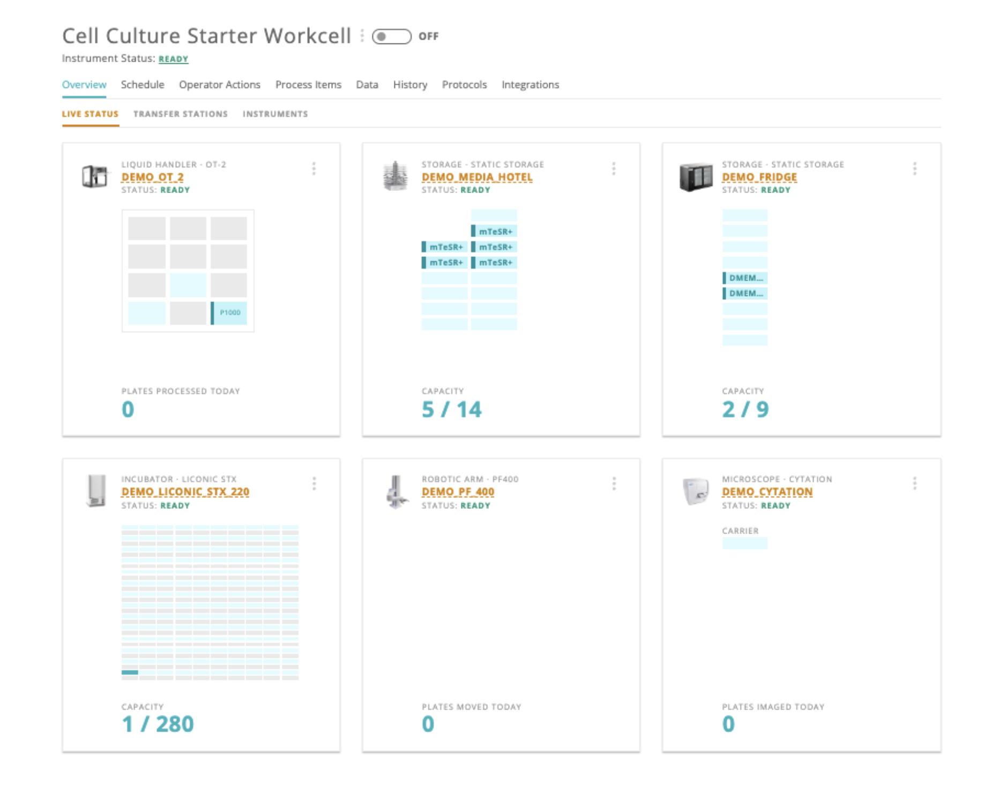
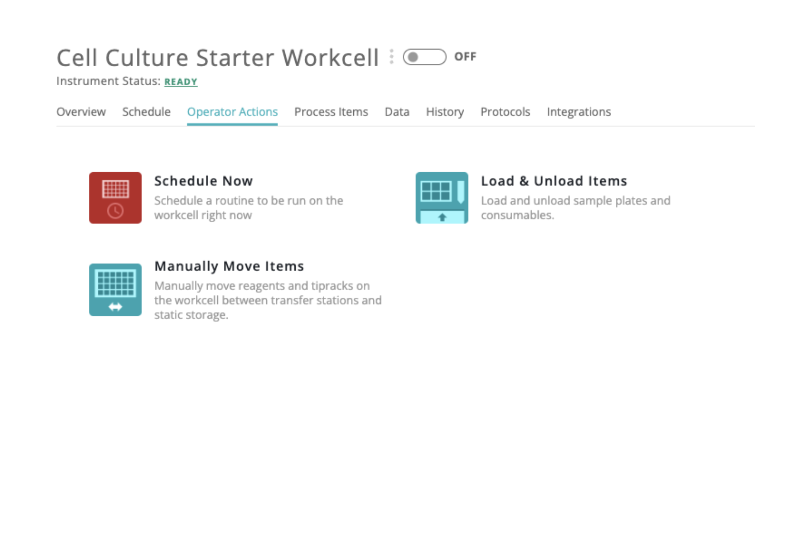
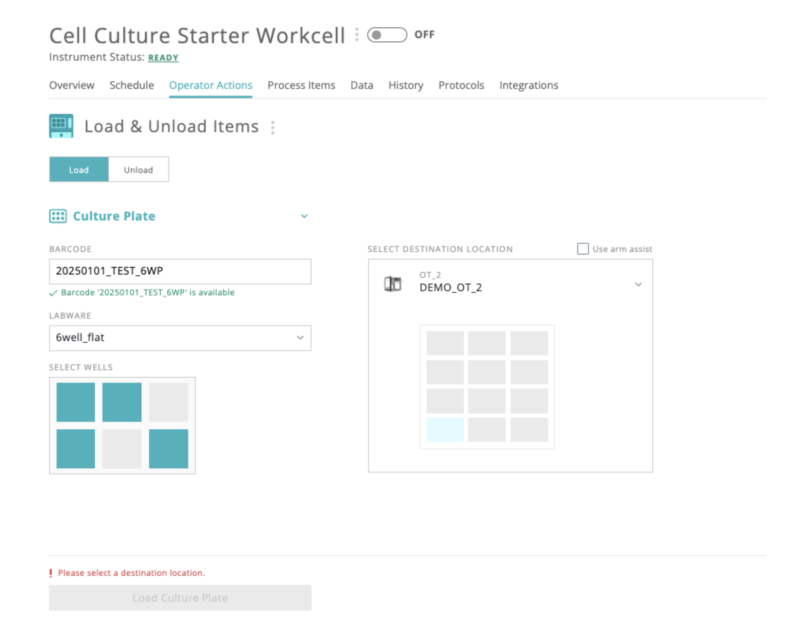
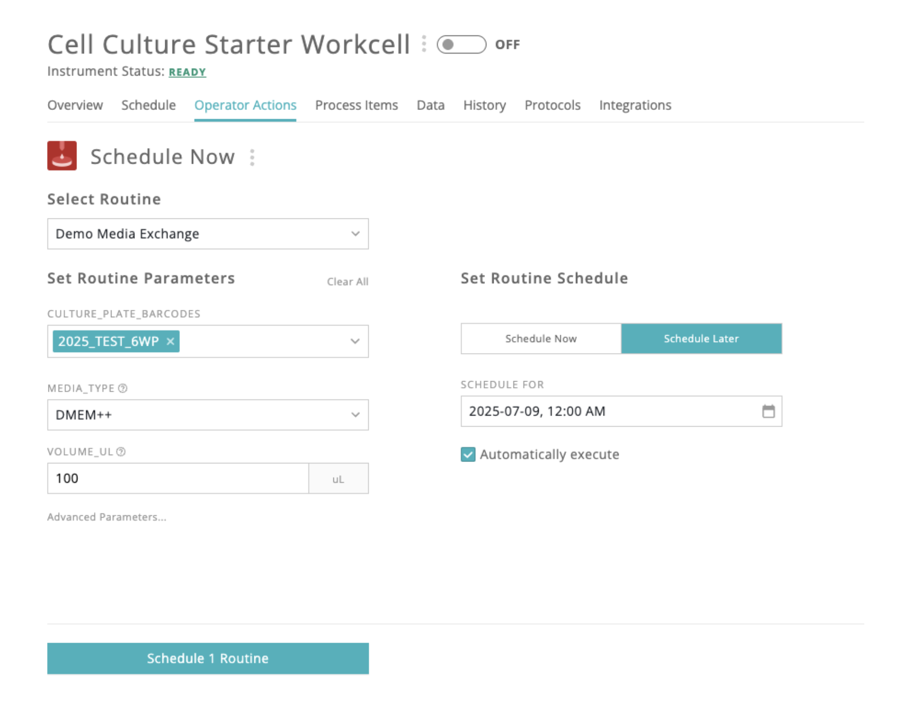
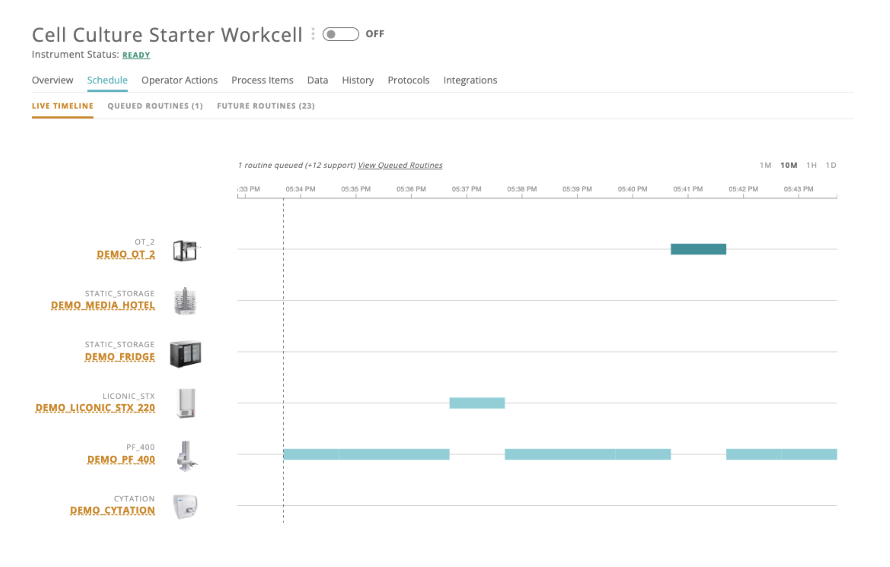
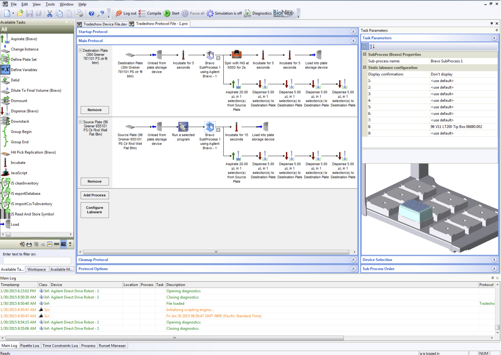
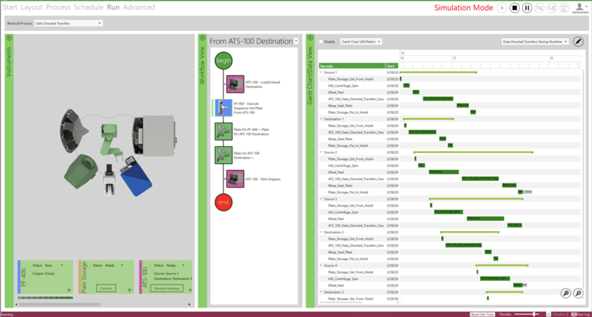

# personal-portfolio

Below is a sample of my past work, mostly focused on user interfaces that I designed or worked on during my career as software engineer.

If you are looking for code samples, you can view my open-source PRs from CZI [here](https://github.com/chanzuckerberg/czid-web/pulls?q=is%3Apr+is%3Aclosed+author%3Amarkazhang). Here are a few meaty ones: [PR 1](https://github.com/chanzuckerberg/czid-web/pull/2716)
, [PR 2](https://github.com/chanzuckerberg/czid-web/pull/2402), [PR 3](https://github.com/chanzuckerberg/czid-web/pull/1787).

## Monomer Bio

At Monomer Bio, I was Co-Founder/CTO. Our product was an orchestration platform that helped scientists to run experiments on complex robotic systems without prior expertise. For more context, you can view [a video](https://www.youtube.com/watch?v=PeNAksAOVs8) from one of our early customers.

In addition to building our product from scratch, I led product and design. I personally specced and designed every user-facing feature for the first 3 years of the company, including everything below.

Below are screenshots from public videos that we displayed at conferences (used with permission from Monomer). They encompass only a subset of what I built at Monomer, but should give you a general impression of my work.

### Live Status

Here is the Live Status screen for our system, which gives a quick snapshot of what is loaded onto the system.

Users could hover on specific items to view more details and perform targeted actions.

### Operator Actions

We consolidated the core user workflows for our system into three customizable operator actions.

Schedule Now and Load/Unload Items were used daily to execute tasks and move items on and off the system.

Manually Move items was used during error recovery.

### Load and Unload Items

This action allowed users to load items onto the system.

The interface hides a lot of complexity. For example, users can select from multiple item types (each with their own fields) and multiple target instruments (each with their own layouts and constraints). Users could even load or unload multiple items in bulk.

The design is modular and extensible: the interface has a common layout and appearance regardless of which options you select.

### Schedule Now

This action allowed users to schedule biological "routines" (our name for a unit of work) onto the system. Users could specify parameters and schedule the routine for now or defer it to later.

Note: the action was later renamed to Schedule Routines, but the screenshot shows the old text.

### Live Timeline

Finally, the live timeline shows what is currently executing and will execute next on the system.

### Conclusion

With our orchestration platform, I wanted to make lab automation as accessible as possible for biologists with no robotics expertise. To this end, I designed streamlined interfaces that displayed only the minimal information needed to finish the job at hand, and used only biologist-friendly language. This took a number of user interviews and iterations to fully nail down.

As a point of comparison, here are screenshots from a couple of leading schedulers at the time.

While these software were powerful and reliable, users often took months to onboard (based on anecdotal evidence) and companies often had to hire personnel with specialized expertise to operate the software.

I'm proud to say that we regularly onboarded scientists onto our software in a few hours.
